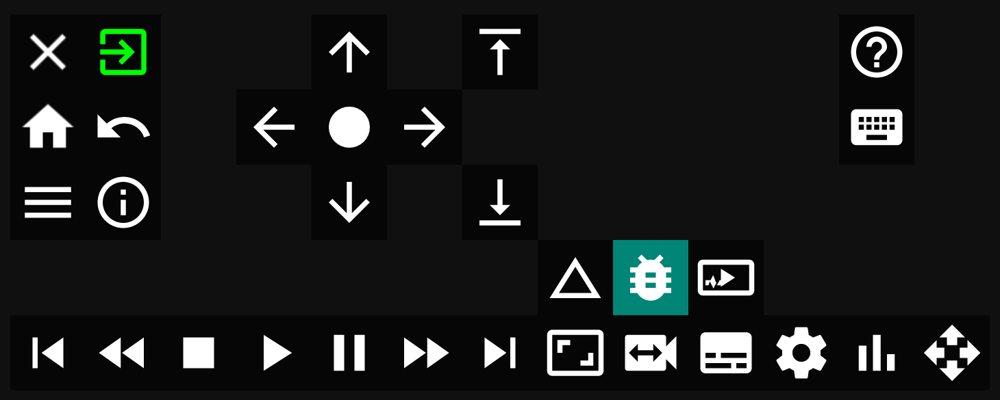
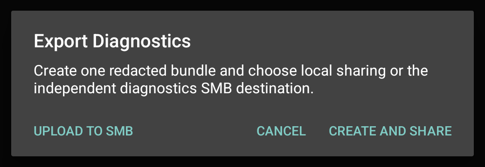
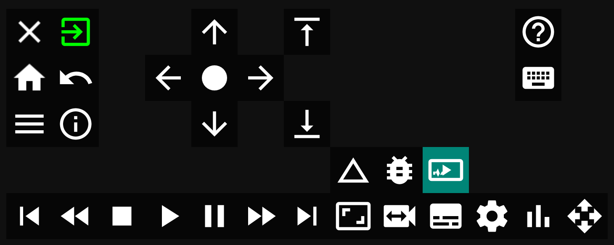
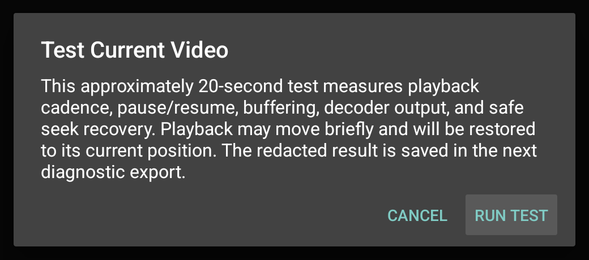

# Android playback diagnostic standard

This document defines the evidence and experiment discipline for diagnosing
OpenSageTV Vibe Android playback. Active work is tracked only in `TASKS.md`.
Historical implementation results remain in `CHANGELOG.md`, `HANDOFF.md`, and
the versioned matrix-review documents.

## Safety boundary

- Test only `opensagetv.vibe.miniclient.debug`.
- Never stop, uninstall, clear, replace, or modify a package beginning with
  `jvl.sage.miniclient`.
- Complete first-time setup manually after a fresh install or cleared app data.
  Automated tests must not attempt onboarding.
- Normal app use keeps the generated and persisted client ID. Scripted launch
  and MCP/player tests default to `44:45:56:30:30:31` (`DEV001`); an explicit
  `--client-id` wins.
- Do not delete recordings or alter the SageTV media library during testing.
- Keep legacy ExoPlayer as the default until physical parity gates approve a
  replacement.

## Evidence-first rule

A timeline change is not proof of successful playback. A playback operation
passes only when the expected video and audio output counters resume advancing
and remain healthy through the observation window. Keep position, buffer,
surface, and wrapper flags as diagnostic context.

Before changing code after a failure, capture:

- player family and effective backend;
- Push, Pull, or Fixed streaming mode;
- hardware/software/fallback decode request and actual decoder;
- recording/container/codecs and completed-versus-growing state;
- requested action and requested target;
- visible symptom and screenshot where useful;
- Android player errors, renderer state, first-frame and audio counters;
- datasource open/read/wait/byte counters;
- SageTV server request, transfer, mux, and transcoder evidence;
- process/crash status and exact timestamps.

Debug APKs also maintain a persistent structured playback trace in app-private
storage. `playback-trace.jsonl` records exact event and wall/monotonic times,
connection and playback generations, requested/applied seek details, player and
buffer positions, decoder input/output counters, surface validity, and playback
state. It is written on a low-priority background worker, contains no media
payloads, redacts URI credentials and secret-like fields, and rotates at 2 MiB
with three retained files. It therefore survives player teardown and SageTV's
on-screen error dialog without growing without bound.

`./dev.sh player-diag LABEL` and MCP `collect_playback_diagnostics` export all
available rotations, oldest first, into `*_playback-trace.jsonl`. MCP also
provides `playback_trace_status`, `set_playback_trace_enabled`, and
`clear_playback_trace`. Tracing defaults on in debug builds, its enabled state
persists across app restarts, disabling preserves existing evidence, and clearing removes
only these bounded debug trace files. `analyze_playback_trace` exports and
summarizes DEINIT/reconnect/OPENURL cycles, requested/applied seeks, time to
first frame, generations, trace gaps, and error/timeout events. Release APKs do
not contain this recorder or its debug broadcast controls.

The on-screen **Playback Stats** panel is the preferred first look during a
physical reproduction. Use compact mode while watching for a symptom and
detailed mode to correlate it with decoder, datasource, synchronization, and
transport counters. The three bars show measured media activity, buffered
playback time, and CPU. The CPU bar uses a fixed 0-100% scale with Vibe and the
remainder of device CPU in separate colors. The `Vibe` and `Other` label values
use those same colors, with a neutral `Total`. Values appear once above each bar;
duplicate detail rows and the invariant estimated link-capacity bar are omitted.
Detail rows use the same 10.5sp normal typeface as the graph labels.
Export produces a bounded redacted snapshot with no media path, server address,
credential, or client ID. Total-device CPU prefers aggregate `/proc/stat` and
falls back to `/proc/uptime` cumulative idle time, then cached read-only per-CPU
sysfs idle-state counters on Fire OS versions that restrict both proc sources.
A source change resets the interval instead of mixing units. The fallbacks need
no additional permission or service. CPU
sampling starts and stops with the overlay. Preserve the normal MCP/server
evidence as well when a root-cause claim depends on another process.

The long-press navigation panel's bar-chart icon, the submenu's checked/unchecked
row, and MCP use the same overlay controller. The icon is white while disabled
and green while enabled. Use
`dev_set_active_player_overlay(mode="toggle")` for an interactive toggle, or select
`off`, `compact`, `detailed`, or `detailed_30s` when a test needs deterministic state.
The legacy MCP `visible` Boolean remains supported for existing automation.

The panel is a troubleshooting view, not a copy of YouTube's consumer-facing
"Stats for nerds" display. It deliberately excludes video/session IDs,
viewport-versus-optimal-resolution labels, normalized volume, generic color
labels, mystery text, wall-clock date/time, and other fields that do not help
isolate a SageTV transport, buffering, decoder, cadence, seek, caption, or A/V
sync fault.

### Audio output and synchronization

During playback, long-press Select/OK and choose the speaker icon with the cyan
underline. The dedicated **Audio settings** menu uses a compact two-column
layout inspired by Kodi while retaining Vibe's colors. It shows the effective
output, signed audio offset, selected track, and a separate **Set as default
for all media** action. Its nested choices return to the parent audio panel.

- **Decoded PCM stereo** disables encoded passthrough and downmixes decoded
  mono or multichannel audio to 48 kHz-capable stereo PCM. Media3, legacy
  ExoPlayer, and their GSY delegates rebuild once at the same active position;
  IJK already produces decoded PCM. GSY System remains a truthful unsupported
  native control and normal GSY Auto uses its supported Media3 delegate.
- **Encoded passthrough** restores sink capability negotiation. Media3 and
  legacy ExoPlayer then expose a separate, default-off **Passthrough offset**
  switch. Positive values delay encoded-audio presentation timestamps;
  negative values delay video presentation timestamps. The extractor adapters
  delegate encoded sample bytes unchanged. GSY inherits the active delegate;
  IJK remains unavailable.
- **Audio offset** opens a compact top slider bounded from `-4000` to
  `+4000 ms`. Left/Right changes it live in `25 ms` increments. Positive means
  audio later; negative means audio earlier. Back keeps the current-playback
  value and returns to Audio settings. It changes decoded samples only and
  never changes SageTV's timeline or video clock.
- **Set as default for all media** persists the current output choice and
  supported offset as this device's default. Resetting current-session
  overrides reapplies that saved default.
- **A/V sync test** opens a server-independent generated bouncing-ball clip.
  Its impact and dominant one-second click share an authored timestamp, while
  a quiet reference tone keeps external audio paths awake. The compact control
  panel stays in the lower-right side column, outside the ball path. Each
  settled change recreates the local source at the same playback position so
  already buffered samples cannot hide the new timestamp offset. Center resets
  to zero and Back applies the value to the active playback session.
- Encoded-passthrough offset remains an open physical gate. Its saved default
  stays off until Media3, legacy Exo, and their GSY delegates pass both signs,
  zero reset, seek, pause, track/format change, live transition, HOME/return,
  and teardown on a real TV/receiver/ARC encoded route.

The detailed Playback Stats view, MCP snapshot, and exported diagnostics report
the effective audio output, applied offset, and session override. Fire OS
**Best Available** can still add latency in a TV/receiver/ARC processing chain;
Vibe does not apply a model-wide automatic offset. Use decoded stereo first,
then set an offset only against the actual output path being watched.

### Export a support bundle from a TV device

The client can create a bounded, redacted support bundle without requiring an
email or file-manager app on the TV. Configure its destination under
**Settings > SMB Direct Settings > Diagnostic export**. This destination and
its anonymous-or-credential authentication are independent of both media SMB
and configuration SMB.

Choose one mode:

- **Off** keeps diagnostic SMB disabled. Local **Create and share** remains
  available when Android has a suitable share target.
- **On request** uploads one ZIP only after the user confirms the request.
- **Always** maintains one bounded, rotated UTF-8 session log and refreshes it
  atomically at a limited interval and on STOP, errors, background, and exit.
  Failed uploads remain in the protected local spool and retry after launch.

Use **Test diagnostics SMB connection** before reproducing a problem. A pass
reports URL validation, DNS/connect, authentication, share-open, file
write/read/hash/delete, and total latency. The tiny uniquely named test file is
removed immediately. A failure identifies the exact stage without displaying
credentials.

During or immediately after the problem:

1. Long-press the remote Select/OK key to open the playback panel.
2. Select the bug icon beside the triangular **Video Info** icon.
3. In **On request**, choose **Upload to SMB** and confirm. In **Always**,
   choose **Upload now**. Use **Create and share** only when the device has a
   useful Android share destination.
4. In Settings, copy the displayed filename, byte count, SHA-256, last-update
   time, and result into the GitHub issue. Retrieve the matching file from the
   configured SMB directory on another computer and attach it to the issue.





The ZIP contains bounded app logs, recent playback traces, a player snapshot,
redacted device/configuration metadata, and checksums. Review it before public
upload. It excludes credentials, client IDs, server addresses, and full media
paths; never attach a recording unless the user owns it and intends to share
it.

### Test the currently loaded video

The long-press playback panel has a separate **Test Current Video** icon: a
video rectangle with a play symbol and diagnostic pulse. It is independent of
the bug/export icon. With a video already playing, select the test icon and
confirm **Run test**. The bounded test:

- samples sustained playback position, rendered/dropped frames, buffering,
  source reads, decoder/output, display, sync, and transport state;
- while the test is active, inspects at most 64 MiB of MPEG-TS bytes for PAT/
  PMT Teletext descriptors, subtitle page/service metadata, Teletext PES and
  data units, PTS progression, and continuity. It reports the active Pull,
  Push, or SMB Direct source but retains neither payload bytes nor decoded
  subtitle text;
- verifies pause and resume when the stream was originally playing;
- seeks to a safe nearby position, returns, repeats the first target, and
  records recovery time, landing error, bytes/reads, and Pull probe-cache use;
- skips seek checks when a DVD menu is active or the media has no safe seek
  window; and
- restores the original position and play/pause state before showing results.

The test intentionally moves playback for a short period; it does not modify
the media file or SageTV metadata. A session/player replacement aborts the test
safely. Each result is redacted and stored under
`current-video-tests/` in the next manual ZIP, On-request SMB ZIP, or Always
session export. The client retains only the latest four reports. The completion
dialog can immediately view the report or open the normal export flow.

Use this action on the affected device and media before changing player
settings. It makes reports from Fire TV, ONN, NVIDIA, and other Android TV
hardware comparable without requiring MCP or ADB.

### Inspect captions in the current video

Open the long-press playback menu and select the CC icon. The top **Available
in current video (read-only)** section lists the broadcast-caption tracks the
active player has actually discovered, including codec, trustworthy language,
and service/page labels. It also shows the concrete service currently resolved
for virtual CC1 and CC2. Select **Refresh** when playback has only just started
and discovery is still pending. The five rows below change Caption authority,
CC1 Type/Language, or CC2 Type/Language; the inventory and resolved results are
never editable. `No matching service` means the requested combination is not
in this video, while `None detected yet` distinguishes late discovery.

The Teletext preservation result is a pre-decoder transport gate. `preserved` proves that
the selected stock-server/client transport delivered an identified Teletext
subtitle service with PES data units and timestamps to the Android client. It
does not by itself prove successful page decoding or rendering. `not-detected`
is an expected skip for recordings without a Teletext PMT descriptor;
`descriptor-only` or `pes-without-data-units` identifies the smaller transport
or parser boundary to investigate before implementing page decoding.

The commissioned stock-server controls are `Breakfast-26711345-0.ts` and
`ClassicHolbyCity-SinsoftheFather-26696712-0.ts` (Teletext page 888 present),
plus `Taskmaster-ThisIsFoodGlue-26714235-0.ts` (DVB bitmap subtitles only).
On non-Pro Fire TV `.25`, the two positives preserved timestamped PES/data
units with no PTS regressions or continuity errors, while Taskmaster correctly
reported `not-detected`. A valid run must use the original TS through Pull or
SMB Direct; a stock-server low-resolution Push transcode cannot prove source
Teletext preservation.





All public workflow screenshots are tightly cropped captures made while the
project-generated Vibe fixture is playing. They contain no broadcast, movie,
or user recording frame.

If one of these sources is unavailable, record it as unavailable rather than
inferring a cause from another layer.

### Long-recording OSD evidence

Recording length alone is not an accepted root cause for a persistent SageTV
timeline. The ONN v1 regression uses the completed 5.5-hour
`ReconstructionAmericaAftertheCivilWar-48000171-0.ts` fixture and covers
Wait-for-playback On/Off, smooth shuttle, Stop, restart, and an independent idle
observation. On 2026-09-12 the OSD cleared normally against both stock `.175`
and Vibe `.232`; server and client evidence also showed the shuttle rate return
from `4.0` to `1.0`. Preserve this as a non-reproduction. A fix requires an
affected-device trace that correlates GFX commands, remote repeats, playback
rate, and the visible HDMI result.

Debug/MCP server switching must not reuse the old resumed player activity. The
debug receiver closes the prior session, finishes that activity, and applies a
bounded 750 ms teardown delay before launching the new connection. A switch
passes only when the replacement connection generation remains live after the
old activity has completed teardown.

### Stable reference-player comparison

For every reproducible DVD, video, audio, subtitle, demux, timestamp, cadence,
seek, or hardware-decoder defect, compare the same media and device with
current Kodi, VLC, and, when source or observable behavior is available, MX
Player. Inspect the relevant upstream demux, timestamp reconstruction, clock,
frame scheduling, decoder selection, bitstream-conversion, subtitle, and
platform-workaround code before inventing a Vibe-only rule.

Treat reference-player success as a diagnostic lead, not proof that one whole
engine should be embedded. Record the exact upstream behavior and license,
map only the smallest compatible rule into Vibe's existing player boundary,
and validate it with a one-variable before/after test. Never copy a global
device blacklist or codec workaround merely because it exists upstream; the
same failing fixture, Vibe telemetry, and physical hardware must demonstrate
that the rule applies. Preserve hardware decoding, stock SageTV compatibility,
and explicit fallback behavior.

For legacy event-225 captions, advancing protocol counters alone are not a
post-seek pass. Inspect the captured frame: CEA-608 lines must remain in
timestamp order, occupy the normal authored/STV lower-screen rows, and stay
within two seconds of the generated fixture's burned-in PTS. Malformed or
top-screen text with advancing counters indicates packet ordering or retained
decoder state and must fail the physical caption gate.

## Ownership model

### Pull

The Android client opens and reads the SageTV MediaServer stream. Diagnose the
complete chain:

1. SageTV receives the file open/read/seek request.
2. MediaServer reads the requested bytes and writes them to the socket.
3. Android receives those bytes through its Pull datasource.
4. Extractor/player consumes the data.
5. Decoder and renderer resume output.

Separate server starvation or short writes from client extractor preroll,
decoder backlog, surface loss, or stale callbacks.

### Push/Fixed

The server owns mux/transcode and feed timing. Distinguish a genuine
server-originated seek/flush/rebase sequence from a debug-only local player
seek. Do not generalize Push results to Pull-only buffer, read-size, timestamp
search, or seek-policy settings.

## Timeline fields

- `serverRequestedSeekMs`: most recent SageTV protocol seek target.
- `serverAnchorMs`: server-provided Push timeline anchor.
- `health_playerPositionMs`: backend-local Android playback position.
- `sageTimelineMs`: value returned to SageTV by the MiniClient protocol.

Never compare these as if they were interchangeable. Every seek report should
record the requested target, actual backend landing position, applicable server
anchor, duration/live edge, and timestamps for invoke, return, discontinuity,
READY, first frame, and resumed audio.

### Ordinary Push FLUSH continuity

For ordinary Push playback, SageTV can issue FLUSH before the replacement mux
timestamp reaches the client. A backend position of zero during that short
interval is transitional and must not become the basis of a second remote skip
or Commercial Skip request. The client therefore retains the last
backend-proven media time until playback supplies a replacement time. A
`push_media_time_held_during_flush` trace event is emitted once per hold
interval; repeated `GETMEDIATIME` polling must not flood the trace.

This policy is deliberately narrow. A new OPENURL and initial playback still
report zero until their new player is established. Pull/SMB retain datasource
timeline ownership, and DVD Push retains its VM timeline. Do not infer an
absolute program landing from Fixed-transcode backend positions because each
replacement stream can restart its local player clock; use the server target
and mux anchor when they are available, plus advancing A/V and the visible
program position.

### Ordinary Push mux-end calibration

Stock SageTV's detailed PUSHBUFFER timestamp is the mux time at the end of the
bytes currently being pushed. Media3 and legacy ExoPlayer positions are
relative to the start of the byte epoch created by OPENURL or FLUSH. The
client therefore subtracts a proven, bounded first-to-last MPEG-TS PES-PTS
span before supplying the anchor to a player. This keeps SageMC's next/previous
commercial-marker calculation on the same timeline as the recording.

`server_anchor_set` records both the raw `anchorMs` and effective
`timelineStartMs`. `server_push_timeline_calibrated` records the mux end,
effective start, PTS span, and sample count once per epoch. If the payload is
not recognizable 188-byte MPEG-TS, has fewer than two timestamps, or has an
implausible span, the historical raw anchor is retained. The estimator resets
on OPENURL and FLUSH and never applies to DVD Push, Pull, or SMB playback.

For a same-file MPEG-TS cache comparison, keep one player session alive and use
the tuning matrix's `--check absolute_seek --repeat-count N` mode. It seeks to
`--target-ms`, moves `--repeat-away-ms` away, then returns to the identical
target. Compare each `repeatObservation` rather than treating an immediate seek
to the already-current position as a cache hit. Record Pull-session reuse,
probe-cache hit/miss/resident bytes, network reads/bytes/wait, decoder
init/release counts, recovery time, and landing sanity. Reset runtime tuning
after every physical experiment.

## Controlled-experiment rules

- Change one behavioral variable at a time.
- Keep recording, target, backend, decode mode, streaming mode, and observation
  window fixed unless one is the variable under test.
- Use a fresh player/session for settings applied at player construction.
- Run controls before and after the candidate when practical.
- Repeat a candidate at least three times before promoting a default.
- Record invalid startup, EOF/delete-prompt, transport, or ADB failures as
  infrastructure failures, not player results.
- Do not start a measured operation until playback is safely before EOF and
  both expected A/V counters are advancing.
- Preserve contrary evidence; do not select only the fastest observation.

## Current evidence baseline

The `20260828_034725_player_tuning_matrix.json` results showed that the tested
Media3 Pull timestamp-search, read-size, seek-policy, buffering, and codec-mode
combinations did not fix long Comskip recovery. Eight-times TS search was the
more stable baseline, 512 KiB reads did not improve the case, `NEXT_SYNC` did
not beat `CLOSEST_SYNC`, and asynchronous MediaCodec queueing trended worse.
Do not run another broad sweep of the same knobs without new evidence.

Media3 Push Sync versus Auto has now been repeated three times on the same
generated fixture. Sync recovered in 7196/6477/7418 ms. Auto recovered in
8752/4236 ms and expired once at 50650 ms. Sync remains the saved default
because it won two runs and avoided the unbounded stall, although neither mode
is considered a fast Push-seek solution.

On the Cast/Session-pruned v0.5.83 APK, the generated fixture passes hardware
start, fullscreen, single FF, single REW, pause, and resume. One legacy Exo
Pull 16-command rapid mixed FF/REW run recovered video within 314 ms but then
reported `playback_did_not_stay_active,audio_stalled_after_recovery`; preserve
`artifacts/firetv/20260830-080924_mcp_rapid_output_health_*` as the intermittent
baseline. The harness was extended with rapid-only repeats and a fixed fixture
reset. At zero inter-command delay, three subsequent fixed-position repeats
passed on every combination of Media3/legacy ExoPlayer and Pull/SMB Direct.
Pull recovery ranged from 906-1662 ms and SMB Direct from 2541-3636 ms, with
sustained hardware-decoded video and audio after every repeat. No speculative
player sequencing change was made for a failure that could not be reproduced.

The same generated fixture's 120-180 second `.edl` interval passes a strict
server-owned marker test on both backends over Pull and SMB Direct. The test
requires `serverRequestedSeekMs=180000`, fullscreen playback, and sustained
hardware-decoded A/V; an advancing client timeline alone is insufficient.
Measured first physical source read / first rendered frame deltas were:

| Backend | Source | First read | First frame |
| --- | --- | ---: | ---: |
| Media3 | SMB Direct | 625 ms | 799 ms |
| Legacy ExoPlayer | SMB Direct | 539 ms | 728 ms |
| Media3 | SageTV Pull | 911 ms | 1112 ms |
| Legacy ExoPlayer | SageTV Pull | 2483 ms | 2560 ms |

The first two setup attempts were correctly rejected because their narrow
pre-position tolerance expired while playback continued advancing; they were
not product crashes or false passes. The passing command allows bounded elapsed
playback around the marker while still requiring the exact server seek target.

The active technical investigations are maintained in `TASKS.md`. A possible
partial socket write in SageTV `MediaServer.java` was tested with a controlled
NIO/non-NIO A/B and server/client byte correlation. Both paths delivered
consistent positive byte counts and recovered A/V; NIO was slower in the
measured case, so this experiment does not support the partial-write hypothesis.

## Minimum current experiment set

1. Verify current APK/API/branding/client-ID behavior and establish a fresh
   physical baseline.
2. Fix or verify the matrix startup gate so EOF and `AskToDeleteRecording`
   cannot enter a measured case.
3. Preserve the captured server-driven Push seek/flush/anchor ordering while
   investigating the remaining slow recovery; do not transfer seek ownership
   to the local Push backend without new protocol evidence.

## Server partial-write hypothesis

For the non-NIO MediaServer path, record the requested offset/length, disk bytes
read, socket bytes written, connection identity, and whether the normal,
read-ahead, remux, or transcoder path was used. A single `SocketChannel.write`
is not proof that the entire buffer was sent.

If a short write is observed, the server fix must drain the buffer without
advancing the file position prematurely. Blocking and non-blocking socket modes
need correct, separate backpressure behavior. Repeat the same client case after
the correction and compare byte counts and first-frame recovery.

Evidence supporting the hypothesis would include an observed short write, a
repeatable improvement with NIO transfers, or a corrected full-drain path that
removes the stall. NIO merely being faster is insufficient by itself.

The completed generated-fixture A/B produced non-NIO recovery of 340/434 ms
and NIO recovery of 447/638 ms. First physical reads were 85/167 ms versus
558/178 ms; first rendered frames were 621/692 ms versus 728/828 ms. Because
all four runs recovered with consistent MediaServer bytes and NIO did not win,
do not patch Core transfer loops without new direct evidence of a short write.

## Growing live-TV source contract

When `OPENURL` identifies an active/growing recording, every local random-access
adapter must report an unknown total length to its player. The SIZE value seen
at open is only the current readable edge; presenting it as a final content
length can freeze the player timeline while the SageTV file continues growing.
Media3 1.11 may then report `StuckPlayingNotEnding` after 60 seconds. A recovery
must capture the current position before changing player state and must not
silently reopen at zero.

For a live-program transition, a new `OPENURL` owns a new playback generation.
Media3 fast replacement is prohibited when the current item is growing, and
late prepared/completion/error/seek callbacks from IJK or Android System must
be ignored when their player or generation is no longer current. The native
bridges use a bounded ten-second SIZE wait at the live edge; this tolerates
tuner/HDD write gaps without creating an uninterruptible read.

The strict channel-change gate must use a server that implements the Vibe
debug channel-set event. A stock server can validate sustained live playback,
but accepting the Android broadcast does not prove that SageTV changed the
channel; `channel_identity_not_confirmed` on that server is an automation
limitation rather than evidence of a decoder failure.

## Active-player controls derived from Kodi

Kodi's current player settings and Android display implementation were reviewed
as behavior references, not as code to copy. The Vibe control surface uses the
following narrower mappings:

| Kodi behavior | Vibe behavior |
| --- | --- |
| Adjust display refresh rate: Off, Always, On start/stop, On start | `Off`, `Seamless`, and `Always`, plus an explicit restore-on-stop policy. Show content FPS, active display Hz, supported modes, selected mode, and reason. Preserve resolution by default. |
| Display refresh-change delay | Bounded HDMI-settle delay before decoder start/resume. It is not a general playback sleep. |
| Exact and multiple refresh-rate matching | Prefer an exact fractional match (for example 23.976/59.94), then a clean integer multiple. Never invent a mode the display does not report. |
| Audio passthrough toggle and audio information | Current-session passthrough toggle plus resolved codec/output/channel status. Unsupported backends report `unsupported`; a change requiring recreation uses one controlled same-position reload. |
| Audio amplification and centre-channel downmix | Offer only when the active backend is producing decoded PCM and can prove the adjustment is applied. Hide/disable during encoded passthrough rather than silently changing the output path. |
| Video stream selection | Enumerate actual alternate video streams or DVD angles only when both Media3 and the SageTV DVD session expose them. Never present a synthetic selector. |
| Video cache/read-ahead sizing | Source-scoped `Low latency`, `Balanced`, and `Resilient` presets. Raw unbounded byte/time controls remain debug-only. |
| Preferred/default audio language | Preferred language plus prefer-authored-default behavior, without overriding an explicit SageTV track command. |
| Subtitle language/forced-only and subtitle style | `Off`, `Forced only`, preferred language, and authored/default selection. Position, size, background, and opacity apply only to text captions/subtitles. Authored DVD SPU and PGS bitmap overlays retain their authored geometry and palette. |
| Player process information | Live audio/video queue, datasource rate/wait, bitrate, A/V correction, decoder, dropped/rendered frames, content FPS, display Hz, transport, and buffering state, with an export action. |
| View mode/aspect controls | Preserve the existing SageTV aspect commands and bounded Source/Fit/Zoom/Stretch behavior. |

Kodi options deliberately not exposed are its local subtitle browser/search,
brightness/contrast/gamma without a controlled shader path, stereoscopic and
orientation controls, desktop display calibration, desktop software post-processing,
noise/sharpness filters, arbitrary codec parameters, decoder filters, and
deinterlace modes Android does not reliably control. Interlace and HDR state
are diagnostic/read-only unless the Android platform exposes a verified control.
Kodi's speed-based sync-to-display remains experimental because it changes
program speed and conflicts with encoded-audio passthrough. SageTV/STV
continues to own skip intervals and the caption on/off state.

References: [Kodi player/video settings](https://kodi.wiki/view/Settings/Player/Videos),
[Kodi settings definitions](https://github.com/xbmc/xbmc/blob/master/system/settings/settings.xml),
and [Kodi's Android display-mode implementation](https://github.com/xbmc/xbmc/blob/master/xbmc/platform/android/activity/XBMCApp.cpp).

## Result format

Every device or integration run should report:

1. environment, APK version/hash, device/API, server version, and recording;
2. exact configuration and command;
3. startup verdict and whether the case was eligible for measurement;
4. per-operation A/V recovery verdict and time;
5. datasource/server byte and wait evidence;
6. player/decoder/surface/error evidence;
7. likely ownership with confidence and alternatives;
8. files and settings changed;
9. repeatability status;
10. next smallest controlled experiment.

## Validation before delivery

Run, in order:

```bash
./dev.sh test
./dev.sh validate
./dev.sh build
```

Device changes additionally require guarded Dev-only install and launch,
followed by the relevant physical matrix. A build without physical evidence
must say that device gates are pending.
### Unified graphics A/B check

For a stock-server comparison, leave the setting off, reconnect, and capture a
baseline. Then enable **Playback Settings > Use unified HD media-player
graphics (experimental)** and reconnect the same client to the same server.
The debug snapshot reports `unifiedGraphicsSurfaces=true` and the connection
log records the `GFX_YUV_IMAGE_CACHE='UNIFIED'` reply. Disable it and reconnect
to restore the pre-existing handshake.

The equivalent MCP calls are:

```text
dev_set_unified_graphics(enabled=true)
dev_player_state()
dev_set_unified_graphics(enabled=false)
```

The debug APK also accepts the existing `dev_set_player_config` control with
`unified_graphics_surfaces=true|false`. This is a capability setting, so a
currently playing item is not renegotiated in place. Compare the same
MPEG-TS/DVB recording in both sessions and retain the logs; the option is not
intended to change fixed/transcoded playback or replace Media3's clock.

### Native DVD Push buffering check

Do not diagnose a native DVD cadence failure from player position alone. For
main-title playback, compare wall time with both `mediaTimeMs` and
`health_playerPositionMs`, and retain rendered/dropped audio and video counts,
`health_isLoading`, AudioTrack underruns, reconnect counts, and the DVD frame
release histogram.

Media3 DVD Push intentionally uses two buffering behaviors:

- normal title playback starts and resumes after rebuffer only after building
  `5,000 ms` of media (with a `12,000 ms` maximum), avoiding a rapid
  READY/BUFFERING loop when stock DVD Push arrives close to authored bitrate;
- an ended reader generation or pending DVD reprepare bypasses that reserve so
  a short menu/navigation cell can drain and the next VM cell can render.

A title gate must include a sustained motion observation and a nonzero seek.
A menu gate must separately prove root-menu rendering, a submenu transition,
and return/re-entry. Never raise the title reserve globally without checking
the authored short-cell fixture, and never restore a zero rebuffer threshold
merely to make menu cells drain.
