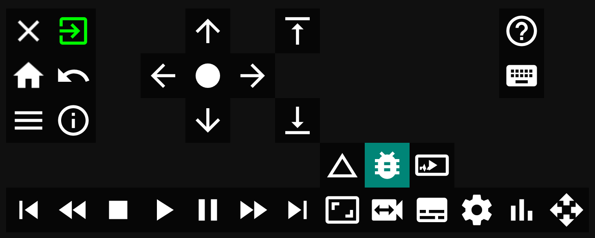
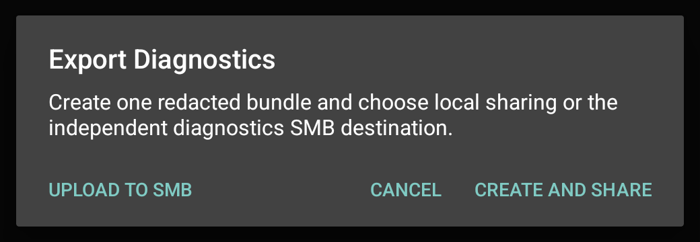
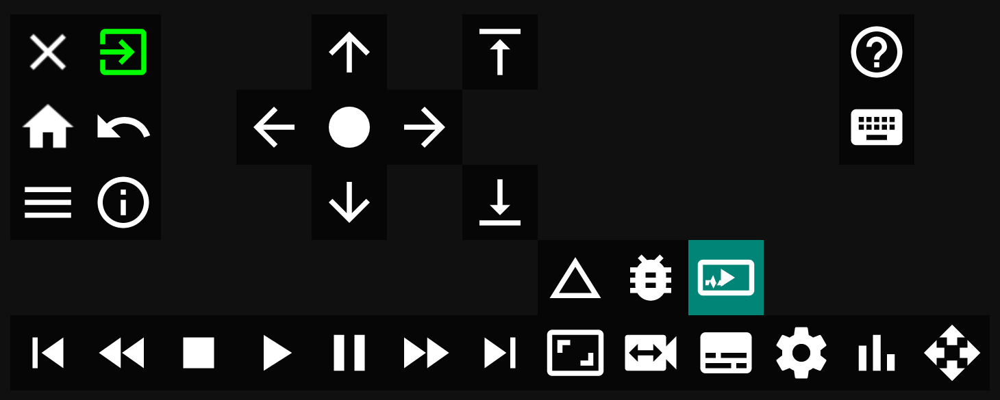
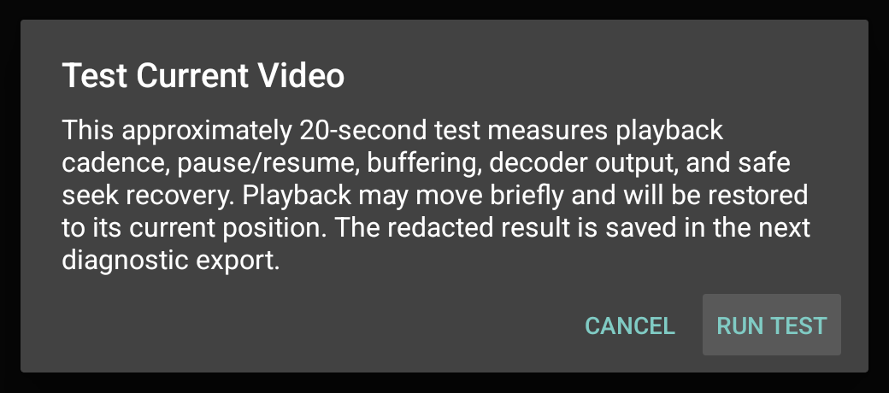

# Android playback diagnostic standard

## DVD test selectors and asynchronous cursor evidence

DVD audio/subpicture expectations use physical packed wire values (for example
AC3 `0xBD81`, enabled SPU `0x40`), not zero-based UI indexes. Confirm readable
SPU and the authored track's tone independently. `mcp_disc_test.py` offers
`--visual-title-hold-s 0..60` for immediate HDMI capture during a main title;
an ended finite title's root menu is not title/audio/subtitle proof.

The cursor test must wait for fresh FLUSH, decoded source anchor and A/V after
Center, not fail on the first stale server NAV response. Its default landing
allowance remains4000ms; explicit15000ms is used only for user-accepted approximate
DVD gates on MiniMX. Never redefine the requested target from its landing echo.
On slow Android6, synchronous `--capture-cursor` can outlast the stock STV's
cursor timeout before Center. Use independent HDMI capture without delaying
acceptance to distinguish that observer effect from a client playback fault.

Held-chapter testing may supplement the authoritative MCP controls with the
explicit `--chapter-index-witness` read-only Sagex `GetDVDCurrentChapter` API.
Require correctly directed authored ordinal changes; several rapid VM commands
can precede one delivered NEWCELL, so that decoder counter alone cannot prove
how many chapters were crossed. Unreadable API is a failure, never an implicit
fallback or reason to change Core. Short taps still must not trigger a seek.

Timed-skip clock verification trims only the initial post-FLUSH prefix before
the first <=2000ms server/decoded-clock agreement, then requires sustained
same-epoch advancing video, audio and clocks. The first ready frame can precede
Core seek-guess expiry; persistent mismatch or any divergence after convergence
still fails. Stock SageTV7 timed FF/RW must not be mislabeled SageMC smooth
scanning; preserve the user's STV/profile and report these as separate gates.

## IJK asynchronous Teletext selection

Before Off/On, continuity and pause gates, verify the fixture's duration and
captioned interval. Classic Holby is82.688s/23,569,848bytes: a late cue followed
by its commercial break and EOF cannot satisfy a new-cue gate. Increasing
the timeout does not create captions past EOF. Use the391.405s Breakfast
sample for this affected IJK sequence, and retain the failed run as inadequate
fixture evidence, not a proven renderer regression. Clock-only playback verdicts
also require independent picture review after HOME/Surface recreation.

For IJK/System, `health_probeSupported=false` means Exo renderer counters are
unavailable; its Exo-only `health_isPlaying` default is not the native playing
flag. The caption oracle uses the already exported `health_basicIsPlaying`
only for that explicit unsupported-probe case. It still requires new nonempty
visible cues, advancing media time, pause-clock stability and no player error.
Missing/false native playing fails recovery; supported Exo paths still require
their own `health_isPlaying`. This corrects the test, not native playback.

When a Teletext service is discovered but IJK still reports selected raw8192,
that is `DISABLE_TRACK`, not a CEA service or a decoder failure. Compare the
inventory event with native prepare: unlike extractor-backed players, IJK has
no native text onTracksChanged callback. MINIMX-IJK-CC-001's verified retry selects
the configured caption slot at those two events with readiness, player-identity
and playback-generation guards. The shared inventory hook is otherwise a no-op.
Do not fix selection by polling a diagnostic getter or advertise native CEA/DVB
support that this backend cannot expose. Require readable captions, Off/On
continuity, seek/pause and stock compatibility before physical closure;
source-contract tests alone are not closure.

Local Teletext Off/seek checks use teletextOverlayVisible/teletextCueUpdateCount;
IJK does not expose the extractor's generic text-overlay fields. An absent field
is not disabled-renderer evidence. Local --pause-resume must actually log the
paused clock hold and new cue progress after PLAY. Earlier local DVB reports
before revision246 did not execute that flag; four focused rows now replace
only those pause claims (MINIMX-CAPTION-TEST-003), not their valid other evidence.

## Restore server caption state as well as app preferences

SageTV VideoFrame.setCCState persists LAST_CC_STATE through uiMgr.putInt;
restoring Android preferences alone does not undo test Off/CC1/CC2 changes.
The caption runner captures the existing public server CC state after connect
and before its controls, restores/verifies that exact value before disconnect
on success/failure, and fails the gate if restoration fails. Do not assume Off
or claim an uncaptured historical baseline was recovered. This uses supported
caption API/MCP controls, not Core modifications or background instrumentation.

## Snapshots must not wait on network-owned monitors

MiniMX/API23 stock175 retained STOP/PLAY produced an ANR: main was waiting
in RetainedBufferedPullDataSource.getSessionReuseCount from a debug event
snapshot, while loader tid30 owned that monitor in a pending MediaServer SIZE
reply. Keep counter writers serialized, but publish these diagnostic-only longs
with volatile and read them without the I/O monitor (atomic on ARM32). Do not
add continuous instrumentation or infer that a readable counter proves source
I/O recovery. Blocked-monitor/publication JVM tests and actual128.306s STOP/PLAY
recovery/snapshot/preference-restoration pass under MINIMX-IO-001. This is an
observer-lock correction, not a general network timeout or decoder change.

## IJK first-frame evidence on the tablet

IJK's native audio/position clock can advance while its hardware video decoder
fails. New debug snapshots include `health_firstVideoFrameRendered` from the
existing real rendering-start callback. MCP rejects an IJK video startup with
that signal false even when its timeline advances. This is not an Exo renderer
counter or proof of sustained output; review bounded captures independently.
Older debug APKs without this field retain their weaker clock fallback, never
full visual proof. Audio-only IJK and typed Media3/legacy/GSY output gates keep
their existing behavior. TABLET-IJK-001 documents the SM-P610/API33 failure.

The SM-P610/API33 UK1080i IJK hardware row remains NOT_WORKING after bounded
client-side experiments. Some start-from-origin controls rendered pictures,
but saved-position startup still fails; all unqualified prefix/probe/native
seek/order/buffer-reset workarounds were withdrawn. Do not infer a general
Samsung/Exynos blacklist or a source-file defect: other client backends render
the fixture and same-coded clean stream-copy controls render in IJK.

One independent ordering defect was demonstrated: IJK rejected native seek0
with invalid-state -3 while the client already reported PLAY during prepare.
The client now queues the newest seek until playerReady, including zero, rather
than losing it and later applying an older bookmark. This does not claim to
fix the native UK hardware failure. Native/default source options and bytes
remain unchanged. Real first-frame/decoder diagnostics and opt-in lifecycle
phase images support future independent review, not automatic picture or
physical speaker/HDMI A/V-sync certification. See TASKS.md for provenance.

This document defines the evidence and experiment discipline for diagnosing
OpenSageTV Vibe Android playback. Active work is tracked only in `TASKS.md`.
Historical implementation results remain in `CHANGELOG.md`, `HANDOFF.md`, and
the versioned matrix-review documents.

The deterministic embedded/server A/V timing comparison and direct webcam
evidence procedure are defined in [AV_SYNC_PHYSICAL_GATE.md](AV_SYNC_PHYSICAL_GATE.md).

## HOME-return decoder output freeze

For generated native DVD lifecycle, use `mcp_lifecycle_test.py
--server-path /var/media/OpenSageTV_Vibe_Tests/OpenSageTV_Vibe_Test_DVD
--authored-dvd-title --player media3 --streaming dynamic --repeat 0
--report <active-task-report>`. The flag verifies the exact public MediaFile
and generated volume before activating its known Play button; it waits for a
new non-menu cell and real A/V. Ordinary file lifecycle remains unchanged.
A looping menu's pause/clock behavior is not main-title evidence. Similarly,
cadence requires actual playing title output before/after its window; a
requested skip-menus setting does not prove stock Core applied it.
Preserve opaque uiContextHint bytes (even scientific-looking hex/leading
zeros), but discover the actual public control context before fixture keys.

Distinguish decoder output from READY/isPlaying or a moving timeline. On ONN
sti6140d360/API34, stock175 UK AVC Pull returned from Home with advancing
audio but fixed video counters, no crash/error and a valid shown1920x1080
Surface. Repeated GSY legacy and direct Media3 gates reproduced it. Surface
attachment lifetime alone did not prevent Activity background Surface loss.
The independent MPEG-2 control froze both A/V after the same Surface switch;
its observed decoder is also covered, and the exact legacy gate passes after
correction. The evidence-scoped `VideoSurfaceCodecPolicy` uses each player's protected
`codecNeedsSetOutputSurfaceWorkaround` hook: codec release/reinitialization on
actual output replacement, keeping the player/source/audio queues and clock.
It does not install a watchdog, seek/reload, or claim every Amlogic codec fails.
Upstream behavior: [legacy Exo renderer](https://github.com/google/ExoPlayer/blob/r2.18.1/library/core/src/main/java/com/google/android/exoplayer2/video/MediaCodecVideoRenderer.java)
and [Media3 renderer](https://github.com/androidx/media/blob/release/libraries/exoplayer/src/main/java/androidx/media3/exoplayer/video/MediaCodecVideoRenderer.java).

Use `mcp_lifecycle_test.py --player media3` or `--player gsyplayer
--gsy-engine legacy_exo`, stock exact-path UK Breakfast, `--streaming pull
--decoding hardware --background-seconds 3 --repeat 1 --report <active-path>`.
Require same connection identity, advancing video AND audio after return,
user PAUSE still paused after a second Home/return, explicit PLAY recovery,
replay and teardown. Inspect decoder release/init counts, not just test exit.
Checkpoint/restore settings and bracket keep-awake as usual. Run only affected
device/codec rows; combinations outside the explicitly observed tuples retain
the players' upstream replacement policy.

ONN Pro SNA/API34 has a separately proven MPEG-2 video-only freeze: output
stays222/queued173 while audio advances after Home, despite a valid Surface.
The same replacement hook fixes its exact legacy and Media3 lifecycle gates.
Its AVC control passes with init1/release0, so AVC on SNA is not included.
The commissioned ONN tuples are sti6140d360/API34 AVC and MPEG-2, and SNA/API34
MPEG-2 (`c2.amlogic.*.decoder`). MiniMX AM2/API23 additionally reproduces
MPEG2-only output stall on OMX.amlogic.mpeg2.decoder.awesome after HOME/return:
audio advances, queued468/rendered386 remain fixed, valid Surface, no error.
Its exact-device codec-replacement candidate is tracked in MINIMX-SURFACE-001;
do not count the candidate as corrected before affected physical gates pass.
Read ro.product.device independently: AM2 is Build.DEVICE, gxbaby is board.
Revalidate these hooks on actual Home/return,
including manual pause preservation; a successful ordinary seek is not proof.

For an intermittent DVD held-scan failure, `mcp_dvd_scan_gesture_test.py`
retains the last full bounded probe plus per-sample decoder inputs/outputs,
byte/read/drain counters, UI context and acknowledged rate. On failure it
collects diagnostics before cleanup sends PLAY. A moving timeline or a later
passing retry does not establish a correction. Keep unique open evidence;
retire completed independent rows only after their compact result is recorded.
First-time SageTV STV setup is per client identity AND server: completing175
does not commission232. A wizard before Watch is setup-required, not a
Direct transport failure; finish manual setup before automated playback.

Include server capacity in stall triage: `.175` is the CPU-constrained stock
reference without hardware transcoding, while `.232` supplies GPU gates.
Record actual transport/transcode jobs and available container utilization/
throttling with decoder and Push-drain probes. Native DVD/Pull are not server
video transcoding; lack of GPU support alone is not fault attribution. See
[server capacity guidance](TEST_ENVIRONMENT.md#server-capacity-is-part-of-the-gate-not-a-client-verdict).

For native DVD scan drain waits, compare epoch-pushed bytes with bytes consumed
and the decoded-ahead value during `lastPushFlags=256` EMPTY polls. Free scan
capacity is intentionally capped at1MiB; do not mistake it for the normal4MiB
physical capacity. In the Pro9min reproduction all input was consumed while
declared decoded tail jumped to6.020s and the last preview froze. Concurrent
container sampling found no transcoder/throttling and modest CPU use.
[Media3 1.11.0 ProgressiveMediaPeriod](https://github.com/androidx/media/blob/1.11.0/libraries/exoplayer/src/main/java/androidx/media3/exoplayer/source/ProgressiveMediaPeriod.java)
derives an unknown EOF duration from queued timestamps including disabled
tracks. The scan-only audio-PES exclusion passes both full Pro scan rows,
including the same9min reproduction (54.901s, both256x, release A/V/PLAY/TS
controls); repeated EMPTY probes report0ms ahead rather than the prior6.020s.
Normal ALADDIN cadence/audio/pause and authored root/Languages/root/title
with visible SPU highlights also pass. This supports the bounded correction;
it does not prove every possible scan stall has the same cause. Preserve the
failure and exact candidate/settings/resource-window distinction in the
compact result. No normal-play clock, audio offset, Core, keys or CPU limits
were changed.

SageMC's `sagemc/default_DVD_FFREW=true` routes FF/RW to timed skips rather
than rate changes. The non-Pro user's deliberately selected profile is recorded
in the deferred DVD-003 handoff; do not change it to satisfy a2x-rate oracle.
Use `mcp_dvd_scan_gesture_test.py --decoder-only --output <active-report>` to
isolate extraction via the existing public SetPlaybackRate plugin boundary.
That API is capped at64x; this is not remote-key or256x evidence. Require
actual new video output at each positive/negative rate and restored A/V at1x.
Authored cell/decoder replacement can reset counters: rebase observations,
never synthesize cumulative output or treat an accepted rate alone as PASS.

## Direct/MIM subtitle selection and seek replacement

For stock ordinary Fixed Push recovery, the Android decoder epoch can reset to
zero at FLUSH while stock Core adds its transcode seek offset in public
GetRawMediaTime/GetMediaTime. A local epoch-only target poll is not a source
position oracle. Require fresh advancing decoded A/V, same typed MediaFile and
exact client context, public source time, and independently reviewed burned
PTS. For paused restoration, await a new FLUSH generation before checking
ready/paused and a held clock; an old ready player can reset during that sample.
The controlled tablet proof passes playing/paused public Watch/42s Seek. This
does not certify the unenabled plugin recovery HTTP candidate or automatic
owned-Transcode fallback. Public Watch launches AsyncWatch and returns a task
marker; defer exactly one Pause until independent replacement readiness,
then queue Seek. Never synchronously query decoder clocks/state from OPENURL
to implement initial-failure capture, or make MCP a runtime dependency.

A failed owned Direct restart must not fall through to an ordinary local
backend seek. The retained HLS representation has the preceding source-time
origin. Vibe keeps that producer/real current clock, clears the pending intent
and tells the user the seek failed. Diagnostic status distinguishes numeric
HTTP rejection and a closed known-code vocabulary from I/O failures without
exporting tokens/URLs/arbitrary responses. The strict ownership gate still
rejects retained failed-restart status as a seek PASS.

For a bounded negative gate, start an owned Copy fixture and run
`mcp_direct_rejection_test.py --output <active-task-report>`. The verified
four-slot provider must have exactly one owner before this gate. A public
60-second seek establishes a nonzero epoch; three gate-owned Copy sessions
force a real409 rejection. The150-second backend-isolation request must keep
the old clock and advancing A/V. The gate releases only its own three tokens;
never stop/prune unrelated sessions. Then prove a normal public seek succeeds
after those slots are free. This fault injection is not a claim about the
cause of an unrelated intermittent server rejection.

The canonical generated seek fixture changes CEA captions every 0.5 seconds;
use it for transport/seek stress, not as the sole visual STV-caption oracle.
For a copyright-free visual CC1/Off/CC1 control, generate a short separate
fixture with the compiled Vibe FFmpeg (set `FFMPEG` to its executable) and:

```text
python scripts/generate_a53_seek_fixture.py --duration 90 \
  --caption-interval 2.0 --cc both --caption-prefix PTS \
  --output <temporary-fixture-path>
```

Import the temporary file through the stock-compatible Core MCP plugin,
resolve its MediaFile ID, and run `mcp-caption-test --media-file-id <id>` with
`--legacy-server-caption-mode stv --authority stv
--legacy-extender-callback --cycle-stv-caption-states
--fixed-caption-side-channel on` for Fixed/MIM Direct. Inspect every
screenshot: event-225 counts alone prove transport, not visible captions.
The 2-second generated control passed stock Windows `.185`/non-Pro `.25` on
2026-10-03, and a real-broadcast CC1 control passed stock `.175`/Pull. Keep
private broadcast screenshots out of public reports. Remove the temporary
import and file after testing and restore all client/device settings.

Initially on2026-10-06, matched120s controls on modified `.232`/Stock STV and Non-Pro
`.25` confirmed readable2s CEA updates on Pull and Direct Transcode after
FF/REW, while freshly generated500ms updates produced empty/gray caption
regions on Pull. Use the command above with `--duration 120` and intervals
`2.0` and `0.5` for reproduction; record both hashes and enable only existing
temporary fixtures in the ignored TOML. The16-character `PTS 00:00:00.000`
row uses14 field1 pairs (six control/idle plus eight text), one pair per
29.97fps picture (~467ms). The500ms schedule gives almost no settled viewing
time and exercises the Core300ms roll-up animation. This explains why it is
a stress fixture, not a standalone normal-display oracle; it does not prove
which internal scheduling/render component is defective.

Fast captions appeared with the existing bounded Core MCP `captions.trace`
enabled, but repeating the same Off/On sequence with tracing disabled did not
restore them. Trace output proved decoded characters/layout and zero parity
errors, not a production fix. Always repeat a diagnostic result with tracing
off and restore the prior property in `finally`; trace logging can perturb
timing. Preserve the fast failure separately from passing2s visual controls.
The corrected client separates raw CEA presentation from 500 ms timeline
polling: Media3 and legacy Exo, including their GSY delegates, use a 33 ms
active/session-owned caption clock. Optional Fixed/MIM presentation has one
independent emitter; HTTP fetching retains its 250 ms budget and cannot block
already-buffered caption delivery. Focused loopback tests cover frame-paced
delivery, unchanged HTTP rate, a blocked poll, and pause/resume. Timeline,
audio, seek, decoder, server/STV and plugin policies are not changed.

Non-Pro .25 corrected fast-cue gates pass on stock .175 and modified .232 with
CC tracing off, including seeks, STV Off/CC1/CC2 transitions, pause/resume and
both GSY delegates. MIM Transcode USB HDMI capture also verifies real startup
and post-seek caption timing. Use `--pre-seek-hold-s 20` with a bounded external
HDMI recording before the harness takes Android screenshots. Android screencap
can hold a video frame while newer UI captions appear; do not infer a permanent
caption/audio offset from that capture alone. This flag defaults to zero,
is bounded to 30 seconds, and changes no runtime setting. The player's real
clock is recorded immediately around the Android capture for comparison.

For a normal-menu DVB/Teletext gate use `--track-codec DVB` or
`--track-codec TELETEXT` rather than assuming row zero. Raw extractor inventory
can include CEA compatibility formats before the real broadcast subtitle PID;
declaration is not proof of CEA payload. This selector only resolves the
expected discovered ID and prefers the matching track already selected by the
normal caption menu, preserving its language/service. It never invokes the
debug track selector or claims that stock CC1/CC2 controls local DVB bitmaps.
The existing ordinal flag remains available for explicit indexed diagnostics.

Do not use the short looping authored DVD for a long uninterrupted cadence
measurement. A natural title/cell transition may reset player counters and
the title clock, making an end-minus-start delta negative despite healthy
playback. Record the cell change and validate menus separately, then use a
long main feature such as the configured `dvd_motion` fixture for cadence.
Do not change production clocks to hide a fixture-boundary measurement.

For an owned HTTP caption gate, add `--require-mim-direct-owned` with
`--streaming fixed --mim-direct-mode copy|transcode`. The harness requires
the negotiated mode, an active owned session, `MIM_DIRECT`, and the matching
HTTP data source. A playable legacy Fixed fallback is safe compatibility
behavior, not proof that Direct or its caption side channel passed.
The check runs both at startup and after the control sequence. A retained
session after a failed restart remains a recorded failure of this strict
restart gate, even if its old HTTP stream and captions still play.

Legacy Exo and its GSY delegate must retain the actual factory-created HLS
child datasource in health snapshots, just like Media3. The ordinary retained
Pull datasource is null for HLS; an active controller flag alone is not enough
to certify transport ownership. The Direct-only HTTP observers also feed TS
segment bytes (never M3U8 text) to the existing Teletext engine without changing
HTTP retries or media bytes. MiniMX exposed this missing legacy diagnostic and
observation boundary; do not weaken the ownership gate to accept blank sources.

`health_directSourceSession` is an on-demand, token-free comparison between the
last requested Direct HTTP child and the controller's current owned session.
`retired` identifies a stale representation; `current` means the HTTP request
addresses the current producer, not that the producer is healthy. `foreign`,
`inactive`, and `unavailable` are explicit non-proof states. Correlate this tag
with the provider's current playlist/job status after a failed seek. The probe
does not subscribe, poll in the background, retry network requests or export
the private URL/token. A successful short seek cannot erase a failed longer
caption Off/On sequence: retain and investigate that separate result.

HLS can pre-create an unopened key/media loader, so the latest factory child
may legitimately be `unavailable`. `health_directMediaItemSession` separately
compares the actual player-bound MediaItem against current ownership. Do not
turn an unopened-child observation into a fake current-request result.

On a current Direct error, bounded snapshots additionally report
`health_directErrorSession`, `health_directErrorAsset` (playlist/segment/other),
`health_directErrorSegmentIndex`, and `health_directErrorCode`. Only the closed
provider codes `media_not_ready`/`unknown_media` and numeric HTTP status are
recognized; arbitrary response bodies and request URLs/tokens remain private.
These are read from the existing error on demand, not packet capture or an
extra background listener. Caption recovery rejects explicit errored/stopped
player health even if an old queued cue increments a counter.

Wait for a stable idle STV before exact-path Watch. UI readiness alone does
not mean the STV has finished asynchronously restoring its previous video.
The caption harness reuses `clear_restored_playback` from the lifecycle gate
to stop only its commissioned test client's restored playback through stock
commands. It also observes the one PAUSE request reaching the current player
within the existing observation budget, then verifies its clock remains held.
Do not replay remote commands, force a different transport, or count an
accepted command as completion to bypass these gates.

Configured SageTV/MIM endpoints commonly use trusted-LAN HTTP. Android 9+
defaults to rejecting cleartext traffic for current target versions; the
shared application manifest explicitly opts in for these user-configured
IP/hostname endpoints. This does not disable HTTPS certificate verification
or turn on optional MIM playback. Inspect the merged APK manifest as well as
source, then require actual ownership on a current Android device. On Shield
Tube/API30, the same `.232` Transcode case fell back before the opt-in and
verified owned HTTP plus active caption delivery afterward, without changing
Core, STV or plugins. See the
[Android network-security documentation](https://developer.android.com/privacy-and-security/security-config#CleartextTrafficPermitted).

The generated testsrc2 pattern includes moving gray rectangles. Decode the
same source frame with the compiled Vibe FFmpeg before treating those shapes
as a corrupt subtitle window. The original19.520s source frame matches the
gray region in the corrected HDMI capture. Partial newest roll-up text is
normal during character arrival; inspect stable previous rows as well.

See `artifacts/results/MATRIX-003/nonpro-affected.json` for measured before/after
rows and exact APK hashes. Original failures remain historical records, with
their corrective rows added separately; completed/corrected raw artifacts are
retired recoverably rather than retained as active failures.

An explicit subtitle/caption track chosen during an active session has higher
priority than a persisted CC/DVB default when Media3 or legacy Exo publishes a
new track map. On a Direct seek, the backend wrapper retains the requested
track but clears the released backend's applied selection. The replacement
backend must report the requested raw track again, recreate the overlay when
Android owns presentation, and resume non-empty cues.

The physical commissioning gate uses the generated timestamped CEA fixture and
requires all of the following: track discovery, raw-track selection, non-empty
cues, Off/On without restart, continuing cues, advancing A/V after seek,
post-seek cue updates, attached overlay, no player error, and settings
restoration. The debug seek sampler may wait through transient segmented-stream
BUFFERING only inside the existing recovery deadline; decoder/audio progress,
surface validity, and error checks are not relaxed.

## Safety boundary

- Test only `opensagetv.vibe.miniclient.debug`.
- Never stop, uninstall, clear, replace, or modify a package beginning with
  `jvl.sage.miniclient`.
- Complete first-time setup manually after a fresh install or cleared app data.
  Automated tests must not attempt onboarding.
- Normal app use keeps the generated and persisted client ID. Scripted launch
  and MCP/player tests default to `44:45:56:30:30:31` (`DEV001`); an explicit
  `--client-id` wins.
- Do not delete recordings or alter the SageTV media library during testing.
- Keep legacy ExoPlayer as the default until physical parity gates approve a
  replacement.

## Evidence-first rule

A timeline change is not proof of successful playback. A playback operation
passes only when the expected video and audio output counters resume advancing
and remain healthy through the observation window. Keep position, buffer,
surface, and wrapper flags as diagnostic context.

Before changing code after a failure, capture:

- player family and effective backend;
- Push, Pull, or Fixed streaming mode;
- hardware/software/fallback decode request and actual decoder;
- recording/container/codecs and completed-versus-growing state;
- requested action and requested target;
- visible symptom and screenshot where useful;
- Android player errors, renderer state, first-frame and audio counters;
- datasource open/read/wait/byte counters;
- SageTV server request, transfer, mux, and transcoder evidence;
- process/crash status and exact timestamps.

Debug APKs also maintain a persistent structured playback trace in app-private
storage. `playback-trace.jsonl` records exact event and wall/monotonic times,
connection and playback generations, requested/applied seek details, player and
buffer positions, decoder input/output counters, surface validity, and playback
state. It is written on a low-priority background worker, contains no media
payloads, redacts URI credentials and secret-like fields, and rotates at 2 MiB
with three retained files. It therefore survives player teardown and SageTV's
on-screen error dialog without growing without bound.

`./dev.sh player-diag LABEL` and MCP `collect_playback_diagnostics` export all
available rotations, oldest first, into `*_playback-trace.jsonl`. MCP also
provides `playback_trace_status`, `set_playback_trace_enabled`, and
`clear_playback_trace`. Tracing defaults on in debug builds, its enabled state
persists across app restarts, disabling preserves existing evidence, and clearing removes
only these bounded debug trace files. `analyze_playback_trace` exports and
summarizes DEINIT/reconnect/OPENURL cycles, requested/applied seeks, time to
first frame, generations, trace gaps, and error/timeout events. Release APKs do
not contain this recorder or its debug broadcast controls.

Release and debug APKs also provide a separate, bounded automatic Push-stall
incident recorder. It defaults on under **Settings > Diagnostics Settings >
Automatic Push-stall diagnostics** and can be disabled independently of file
logging and SMB export. It remains idle during healthy playback. After an
already-playing ordinary Push stream stays in BUFFERING for at least 1.5
seconds, it retains at most 30 seconds of incident samples and a three-second
post-recovery tail, writes asynchronously, and keeps four files. Pull, SMB
Direct, MIM Direct, DVD Push, initial startup buffering, and external players
do not qualify.

Each incident correlates Push arrival/completion and blocked-write time, ring
used/free bytes, decoder read/wait cadence, player position/buffer/state,
selected decoder, and connection generation/reconnect count. It contains no
media bytes, media path or URI, server address, credentials, or client ID.
Manual diagnostic ZIPs and Always-mode logs include the retained incidents.
This is evidence only: it does not change bytes, free-space replies, seek
destinations, buffering policy, or recovery behavior.

The on-screen **Playback Stats** panel is the preferred first look during a
physical reproduction. Use compact mode while watching for a symptom and
detailed mode to correlate it with decoder, datasource, synchronization, and
transport counters. The three bars show measured media activity, buffered
playback time, and CPU. The CPU bar uses a fixed 0-100% scale with Vibe and the
remainder of device CPU in separate colors. The `Vibe` and `Other` label values
use those same colors, with a neutral `Total`. Values appear once above each bar;
duplicate detail rows and the invariant estimated link-capacity bar are omitted.
Detail rows use the same 10.5sp normal typeface as the graph labels.
Export produces a bounded redacted snapshot with no media path, server address,
credential, or client ID. Total-device CPU prefers aggregate `/proc/stat` and
falls back to `/proc/uptime` cumulative idle time, then cached read-only per-CPU
sysfs idle-state counters on Fire OS versions that restrict both proc sources.
A source change resets the interval instead of mixing units. The fallbacks need
no additional permission or service. CPU
sampling starts and stops with the overlay. Preserve the normal MCP/server
evidence as well when a root-cause claim depends on another process.

The long-press navigation panel's bar-chart icon, the submenu's checked/unchecked
row, and MCP use the same overlay controller. The icon is white while disabled
and green while enabled. Use
`dev_set_active_player_overlay(mode="toggle")` for an interactive toggle, or select
`off`, `compact`, `detailed`, or `detailed_30s` when a test needs deterministic state.
The legacy MCP `visible` Boolean remains supported for existing automation.

The panel is a troubleshooting view, not a copy of YouTube's consumer-facing
"Stats for nerds" display. It deliberately excludes video/session IDs,
viewport-versus-optimal-resolution labels, normalized volume, generic color
labels, mystery text, wall-clock date/time, and other fields that do not help
isolate a SageTV transport, buffering, decoder, cadence, seek, caption, or A/V
sync fault.

### Audio output and synchronization

During playback, long-press Select/OK and choose the speaker icon with the cyan
underline. The dedicated **Audio settings** menu uses a compact two-column
layout inspired by Kodi while retaining Vibe's colors. It shows the effective
output, signed audio offset, selected track, and a separate **Set as default
for all media** action. Its nested choices return to the parent audio panel.

- **Decoded PCM stereo** disables encoded passthrough and downmixes decoded
  mono or multichannel audio to 48 kHz-capable stereo PCM. Media3, legacy
  ExoPlayer, and their GSY delegates rebuild once at the same active position;
  IJK already produces decoded PCM. GSY System remains a truthful unsupported
  native control and normal GSY Auto uses its supported Media3 delegate.
- **Encoded passthrough** restores sink capability negotiation. Media3 and
  legacy ExoPlayer then expose a separate, default-off **Passthrough offset**
  switch. Positive values delay encoded-audio presentation timestamps;
  negative values delay video presentation timestamps. The extractor adapters
  delegate encoded sample bytes unchanged. GSY inherits the active delegate;
  IJK remains unavailable.
- **Audio offset** opens a compact top slider bounded from `-4000` to
  `+4000 ms`. Left/Right changes it live in `25 ms` increments. Positive means
  audio later; negative means audio earlier. Back keeps the current-playback
  value and returns to Audio settings. It changes decoded samples only and
  never changes SageTV's timeline or video clock.
- **Set as default for all media** persists the current output choice and
  supported offset as this device's default. Resetting current-session
  overrides reapplies that saved default.
- **A/V sync test** opens a server-independent generated bouncing-ball clip.
  Its impact and dominant one-second click share an authored timestamp, while
  a quiet reference tone keeps external audio paths awake. The compact control
  panel stays in the lower-right side column, outside the ball path. Each
  settled change recreates the local source at the same playback position so
  already buffered samples cannot hide the new timestamp offset. Center resets
  to zero and Back applies the value to the active playback session.
- Encoded-passthrough offset remains an open physical gate. Its saved default
  stays off until Media3, legacy Exo, and their GSY delegates pass both signs,
  zero reset, seek, pause, track/format change, live transition, HOME/return,
  and teardown on a real TV/receiver/ARC encoded route.

The detailed Playback Stats view, MCP snapshot, and exported diagnostics report
the effective audio output, applied offset, and session override. Fire OS
**Best Available** can still add latency in a TV/receiver/ARC processing chain;
Vibe does not apply a model-wide automatic offset. Use decoded stereo first,
then set an offset only against the actual output path being watched.

### Export a support bundle from a TV device

The client can create a bounded, redacted support bundle without requiring an
email or file-manager app on the TV. Configure its destination under
**Settings > Diagnostics Settings > SMB diagnostic export**. This destination and
its anonymous-or-credential authentication are independent of both media SMB
and configuration SMB.

Choose one mode:

- **Off** keeps diagnostic SMB disabled. Local **Create and share** remains
  available when Android has a suitable share target.
- **On request** uploads one ZIP only after the user confirms the request.
- **Always** maintains one bounded, rotated UTF-8 session log and refreshes it
  atomically at a limited interval and on STOP, errors, background, and exit.
  Failed uploads remain in the protected local spool and retry after launch.

Use **Test diagnostics SMB connection** before reproducing a problem. A pass
reports URL validation, DNS/connect, authentication, share-open, file
write/read/hash/delete, and total latency. The tiny uniquely named test file is
removed immediately. A failure identifies the exact stage without displaying
credentials.

During or immediately after the problem:

1. Long-press the remote Select/OK key to open the playback panel.
2. Select the bug icon beside the triangular **Video Info** icon.
3. In **On request**, choose **Upload to SMB** and confirm. In **Always**,
   choose **Upload now**. Use **Create and share** only when the device has a
   useful Android share destination.
4. In Settings, copy the displayed filename, byte count, SHA-256, last-update
   time, and result into the GitHub issue. Retrieve the matching file from the
   configured SMB directory on another computer and attach it to the issue.





The ZIP contains bounded app logs, recent playback traces, a player snapshot,
redacted device/configuration metadata, and checksums. Review it before public
upload. It excludes credentials, client IDs, server addresses, and full media
paths; never attach a recording unless the user owns it and intends to share
it.

### Test the currently loaded video

The long-press playback panel has a separate **Test Current Video** icon: a
video rectangle with a play symbol and diagnostic pulse. It is independent of
the bug/export icon. With a video already playing, select the test icon and
confirm **Run test**. The bounded test:

- samples sustained playback position, rendered/dropped frames, buffering,
  source reads, decoder/output, display, sync, and transport state;
- while the test is active, inspects at most 64 MiB of MPEG-TS bytes for PAT/
  PMT Teletext descriptors, subtitle page/service metadata, Teletext PES and
  data units, PTS progression, and continuity. It reports the active Pull,
  Push, or SMB Direct source but retains neither payload bytes nor decoded
  subtitle text;
- verifies pause and resume when the stream was originally playing;
- seeks to a safe nearby position, returns, repeats the first target, and
  records recovery time, landing error, bytes/reads, and Pull probe-cache use;
- skips seek checks when a DVD menu is active or the media has no safe seek
  window; and
- restores the original position and play/pause state before showing results.

The test intentionally moves playback for a short period; it does not modify
the media file or SageTV metadata. A session/player replacement aborts the test
safely. Each result is redacted and stored under
`current-video-tests/` in the next manual ZIP, On-request SMB ZIP, or Always
session export. The client retains only the latest four reports. The completion
dialog can immediately view the report or open the normal export flow.

Use this action on the affected device and media before changing player
settings. It makes reports from Fire TV, ONN, NVIDIA, and other Android TV
hardware comparable without requiring MCP or ADB.

### Inspect captions in the current video

Open the long-press playback menu and select the CC icon. The top **Available
in current video (read-only)** section lists the broadcast-caption tracks the
active player has actually discovered, including codec, trustworthy language,
and service/page labels. It also shows the concrete service currently resolved
for virtual CC1 and CC2. Select **Refresh** when playback has only just started
and discovery is still pending. The five rows below change Caption authority,
CC1 Type/Language, or CC2 Type/Language; the inventory and resolved results are
never editable. `No matching service` means the requested combination is not
in this video, while `None detected yet` distinguishes late discovery.

The Teletext preservation result is a pre-decoder transport gate. `preserved` proves that
the selected stock-server/client transport delivered an identified Teletext
subtitle service with PES data units and timestamps to the Android client. It
does not by itself prove successful page decoding or rendering. `not-detected`
is an expected skip for recordings without a Teletext PMT descriptor;
`descriptor-only` or `pes-without-data-units` identifies the smaller transport
or parser boundary to investigate before implementing page decoding.

The commissioned stock-server controls are `Breakfast-26711345-0.ts` and
`ClassicHolbyCity-SinsoftheFather-26696712-0.ts` (Teletext page 888 present),
plus `Taskmaster-ThisIsFoodGlue-26714235-0.ts` (DVB bitmap subtitles only).
On non-Pro Fire TV `.25`, the two positives preserved timestamped PES/data
units with no PTS regressions or continuity errors, while Taskmaster correctly
reported `not-detected`. A valid run must use the original TS through Pull or
SMB Direct; a stock-server low-resolution Push transcode cannot prove source
Teletext preservation.





All public workflow screenshots are tightly cropped captures made while the
project-generated Vibe fixture is playing. They contain no broadcast, movie,
or user recording frame.

Physical-test evidence must not remain in Android shared storage after it has
been pulled to the workspace. Use the MCP screenshot operation, which streams
PNG bytes directly through `adb exec-out`, and the MCP screen-record operation,
which uses `/sdcard/OpenSageTV_Vibe_Test_Temp` and removes its unique remote
file in `finally` handling. Ad-hoc `screencap`, `uiautomator dump`, trace, or
`screenrecord` commands must follow the same dedicated-directory and
pull-then-clean rule; never write test artifacts into `/storage/emulated/0`.

If one of these sources is unavailable, record it as unavailable rather than
inferring a cause from another layer.

### Long-recording OSD evidence

Recording length alone is not an accepted root cause for a persistent SageTV
timeline. The ONN v1 regression uses the completed 5.5-hour
`ReconstructionAmericaAftertheCivilWar-48000171-0.ts` fixture and covers
Wait-for-playback On/Off, smooth shuttle, Stop, restart, and an independent idle
observation. On 2026-09-12 the OSD cleared normally against both stock `.175`
and Vibe `.232`; server and client evidence also showed the shuttle rate return
from `4.0` to `1.0`. Preserve this as a non-reproduction. A fix requires an
affected-device trace that correlates GFX commands, remote repeats, playback
rate, and the visible HDMI result.

Debug/MCP server switching must not reuse the old resumed player activity. The
debug receiver closes the prior session, finishes that activity, and applies a
bounded 750 ms teardown delay before launching the new connection. A switch
passes only when the replacement connection generation remains live after the
old activity has completed teardown.

### Stable reference-player comparison

For every reproducible DVD, video, audio, subtitle, demux, timestamp, cadence,
seek, or hardware-decoder defect, compare the same media and device with
current Kodi, VLC, and, when source or observable behavior is available, MX
Player. Inspect the relevant upstream demux, timestamp reconstruction, clock,
frame scheduling, decoder selection, bitstream-conversion, subtitle, and
platform-workaround code before inventing a Vibe-only rule.

Treat reference-player success as a diagnostic lead, not proof that one whole
engine should be embedded. Record the exact upstream behavior and license,
map only the smallest compatible rule into Vibe's existing player boundary,
and validate it with a one-variable before/after test. Never copy a global
device blacklist or codec workaround merely because it exists upstream; the
same failing fixture, Vibe telemetry, and physical hardware must demonstrate
that the rule applies. Preserve hardware decoding, stock SageTV compatibility,
and explicit fallback behavior.

For legacy event-225 captions, advancing protocol counters alone are not a
post-seek pass. Inspect the captured frame: CEA-608 lines must remain in
timestamp order, occupy the normal authored/STV lower-screen rows, and stay
within two seconds of the generated fixture's burned-in PTS. Malformed or
top-screen text with advancing counters indicates packet ordering or retained
decoder state and must fail the physical caption gate.

## Ownership model

### Pull

The Android client opens and reads the SageTV MediaServer stream. Diagnose the
complete chain:

1. SageTV receives the file open/read/seek request.
2. MediaServer reads the requested bytes and writes them to the socket.
3. Android receives those bytes through its Pull datasource.
4. Extractor/player consumes the data.
5. Decoder and renderer resume output.

Separate server starvation or short writes from client extractor preroll,
decoder backlog, surface loss, or stale callbacks.

### Push/Fixed

The server owns mux/transcode and feed timing. Distinguish a genuine
server-originated seek/flush/rebase sequence from a debug-only local player
seek. Do not generalize Push results to Pull-only buffer, read-size, timestamp
search, or seek-policy settings.

### Optional MIM Direct Fixed

MIM Direct is an explicitly selected, capability-negotiated Fixed transport
owned by the optional stock-compatible FFmpeg Standard plugin. `Direct Copy`
must report no video/audio decode or encode; `Direct Transcode` must report its
actual full-GPU, mixed, or software stage. The plugin API is tokenless and
LAN-scoped, but source starts remain SageTV-authorized and later operations use
opaque bounded session handles.

The Direct playlist contains MPEG-TS segments so CEA, Teletext, DVB bitmap,
language, and timing metadata survive. Media3 observes only the bytes read from
those Direct `.ts` segments and feeds them to the existing bounded Teletext PES
probe/local caption engine. It does not inspect M3U8 bytes or instrument Push,
Pull, SMB, or ordinary Fixed playback. Diagnostics identify the source as
`MIM_DIRECT`.

Fixed/MIM exposes `Auto`, `On`, and `Off` deinterlacing because the optional
plugin owns that server-side filter stage. This is not an Android MediaCodec
deinterlacer. Record the plugin's actual execution path: on the commissioned
hosts, Linux VAAPI is full-GPU for all three policies, while Windows Haswell
QSV is full-GPU with Off and truthfully falls back to a mixed path for Auto/On
when its VPP deinterlacer rejects the input surface contract.

In STV caption authority, an active Fixed caption side channel is the sole
producer for SageTV event 225. The same Direct transport may preserve a CEA
track for explicit Android-local modes, but that track must remain disabled
locally while the side channel is forwarding. A physical gate must require
advancing event-225 counters, detached local subtitle and Teletext overlays,
visible CC1, clear Off, and zero active sessions after teardown. Merely seeing
a caption track in Media3 is not proof of correct single-renderer ownership.

When the plugin is absent, old, disabled, or unreachable before capability
negotiation, the client must report the Direct state and retain ordinary stock
Fixed without losing the SageTV session. A stock fallback gate must prove
advancing A/V and lifecycle recovery, not merely the expected diagnostic
string.

A failure after Direct negotiation is a different phase. SageTV has already
been told that the client can Pull the original source, so a failed plugin
session currently reports `start_failed_pull_fallback` and opens that source
through ordinary `SAGETV_PULL`. This is physically proven for a playable H.264
TS source, including FF/REW and pause recovery. It is not equivalent to
renegotiating Fixed: when the original source cannot be decoded directly, the
client still needs a bounded reconnect/re-watch with Direct disabled. Keep that
case open and never report the late-start gate as ordinary Fixed/Push.

The frozen IJK 0.8.8 backend is physically supported for `Direct Copy`, but not
for `Direct Transcode`: its MediaCodec path enters a repeated illegal state on
the proven Transcode output. The client therefore reports
`unsupported_player_stock_fixed` and keeps ordinary Fixed/Push for that one
combination. Media3, legacy Exo, and the GSY Media3/legacy-Exo delegates are
physically proven in both Direct modes on the non-Pro reference device. Do not
classify the IJK fallback as a server or device-profile failure.

## Timeline fields

- `serverRequestedSeekMs`: most recent SageTV protocol seek target.
- `serverAnchorMs`: server-provided Push timeline anchor.
- `health_playerPositionMs`: backend-local Android playback position.
- `sageTimelineMs`: value returned to SageTV by the MiniClient protocol.

Never compare these as if they were interchangeable. Every seek report should
record the requested target, actual backend landing position, applicable server
anchor, duration/live edge, and timestamps for invoke, return, discontinuity,
READY, first frame, and resumed audio.

### Ordinary Push FLUSH continuity

For ordinary Push playback, SageTV can issue FLUSH before the replacement mux
timestamp reaches the client. A backend position of zero during that short
interval is transitional and must not become the basis of a second remote skip
or Commercial Skip request. The client therefore retains the last
backend-proven media time until playback supplies a replacement time. A
`push_media_time_held_during_flush` trace event is emitted once per hold
interval; repeated `GETMEDIATIME` polling must not flood the trace.

This policy is deliberately narrow. A new OPENURL and initial playback still
report zero until their new player is established. Pull/SMB retain datasource
timeline ownership, and DVD Push retains its VM timeline. Do not infer an
absolute program landing from Fixed-transcode backend positions because each
replacement stream can restart its local player clock; use the server target
and mux anchor when they are available, plus advancing A/V and the visible
program position.

### Ordinary Push mux-end calibration

Stock SageTV's detailed PUSHBUFFER timestamp is the mux time at the end of the
bytes currently being pushed. Media3 and legacy ExoPlayer positions are
relative to the start of the byte epoch created by OPENURL or FLUSH. The
client therefore subtracts a proven, bounded first-to-last MPEG-TS PES-PTS
span before supplying the anchor to a player. This keeps SageMC's next/previous
commercial-marker calculation on the same timeline as the recording.

`server_anchor_set` records both the raw `anchorMs` and effective
`timelineStartMs`. `server_push_timeline_calibrated` records the mux end,
effective start, PTS span, and sample count once per epoch. If the payload is
not recognizable 188-byte MPEG-TS, has fewer than two timestamps, or has an
implausible span, the historical raw anchor is retained. The estimator resets
on OPENURL and FLUSH and never applies to DVD Push, Pull, or SMB playback.

### One-shot post-Comskip Push recovery

A long-Right command only arms observation; it does not transfer the seek or
commercial-marker destination to Android. The recovery gate requires the next
ordinary-Push FLUSH and the first non-empty payload in that replacement byte
epoch. A positive detailed-stat mux time remains the absolute timeline anchor,
but stock Fixed may validly report zero; in that case the payload confirms only
the new epoch and must not be promoted to an absolute program position.

After confirmation, Media3, legacy Exo, IJK, and their GSY delegates observe
first-frame and buffering callbacks. Five seconds of stable playback completes
the gate with no action. A missing first frame or a post-frame stall permits
one local Push-reader flush/reprepare only; a second server seek is never sent.
The gate expires when any required event is absent. It does not run for Pull,
SMB Direct, plugin-owned MIM Direct, DVD Push, or external/system players.

Retain these bounded trace events when diagnosing a report:

- `post_seek_push_recovery_armed`
- `post_seek_push_server_flush`
- `post_seek_push_server_anchor`
- `post_seek_push_recovery_healthy` or `post_seek_push_recovery_started`
- `post_seek_push_recovery_expired` when the event chain was incomplete

An ordinary healthy gate must show advancing audio/video after the anchor and
must not contain `post_seek_push_recovery_started`. A forced-stall/unit gate
must prove at most one start and continued server ownership of the target.

For a same-file MPEG-TS cache comparison, keep one player session alive and use
the tuning matrix's `--check absolute_seek --repeat-count N` mode. It seeks to
`--target-ms`, moves `--repeat-away-ms` away, then returns to the identical
target. Compare each `repeatObservation` rather than treating an immediate seek
to the already-current position as a cache hit. Record Pull-session reuse,
probe-cache hit/miss/resident bytes, network reads/bytes/wait, decoder
init/release counts, recovery time, and landing sanity. Reset runtime tuning
after every physical experiment.

## Controlled-experiment rules

- Change one behavioral variable at a time.
- Keep recording, target, backend, decode mode, streaming mode, and observation
  window fixed unless one is the variable under test.
- Use a fresh player/session for settings applied at player construction.
- Run controls before and after the candidate when practical.
- Repeat a candidate at least three times before promoting a default.
- Record invalid startup, EOF/delete-prompt, transport, or ADB failures as
  infrastructure failures, not player results.
- Do not start a measured operation until playback is safely before EOF and
  both expected A/V counters are advancing.
- Preserve contrary evidence; do not select only the fastest observation.

## Current evidence baseline

For a client without HDMI capture, the hardware codec harness offers
`--capture-each-case`. It streams a composited Android screenshot before
cleanup/next Watch replaces that Surface. Review the generated fixture's
burned filename, image and PTS independently; PNG creation is only
`PENDING_VISUAL_REVIEW`, not an automatic visual PASS. Correlate actual
`playerClass`, selected hardware decoder and advancing A/V output, not the
stored default-player preference after settings restoration. This software
capture does not measure physical HDMI/display presentation, speaker sound
or A/V sync. Keep speaker/receiver timing unmeasured without physical capture.

Tab S6 Lite SM-P610/API33 inventory has hardware AVC/HEVC/VP8/VP9 but no
advertised Android MPEG-2 decoder. Run the available hardware cases and
separately record unsupported native hardware/safe handling and any measured
software/owned Transcode alternative; never count software decoding as a
hardware PASS or change Core to manufacture that missing platform capability.
Its stock175 normal first-run profile is verified SageTV7.xml, not the older
non-Pro client's SageMC. STV setup is per generated identity and server.

The `20260828_034725_player_tuning_matrix.json` results showed that the tested
Media3 Pull timestamp-search, read-size, seek-policy, buffering, and codec-mode
combinations did not fix long Comskip recovery. Eight-times TS search was the
more stable baseline, 512 KiB reads did not improve the case, `NEXT_SYNC` did
not beat `CLOSEST_SYNC`, and asynchronous MediaCodec queueing trended worse.
Do not run another broad sweep of the same knobs without new evidence.

Media3 Push Sync versus Auto has now been repeated three times on the same
generated fixture. Sync recovered in 7196/6477/7418 ms. Auto recovered in
8752/4236 ms and expired once at 50650 ms. Sync remains the saved default
because it won two runs and avoided the unbounded stall, although neither mode
is considered a fast Push-seek solution.

On the Cast/Session-pruned v0.5.83 APK, the generated fixture passes hardware
start, fullscreen, single FF, single REW, pause, and resume. One legacy Exo
Pull 16-command rapid mixed FF/REW run recovered video within 314 ms but then
reported `playback_did_not_stay_active,audio_stalled_after_recovery`; preserve
`artifacts/firetv/20260830-080924_mcp_rapid_output_health_*` as the intermittent
baseline. The harness was extended with rapid-only repeats and a fixed fixture
reset. At zero inter-command delay, three subsequent fixed-position repeats
passed on every combination of Media3/legacy ExoPlayer and Pull/SMB Direct.
Pull recovery ranged from 906-1662 ms and SMB Direct from 2541-3636 ms, with
sustained hardware-decoded video and audio after every repeat. No speculative
player sequencing change was made for a failure that could not be reproduced.

The same generated fixture's 120-180 second `.edl` interval passes a strict
server-owned marker test on both backends over Pull and SMB Direct. The test
requires `serverRequestedSeekMs=180000`, fullscreen playback, and sustained
hardware-decoded A/V; an advancing client timeline alone is insufficient.
Measured first physical source read / first rendered frame deltas were:

| Backend | Source | First read | First frame |
| --- | --- | ---: | ---: |
| Media3 | SMB Direct | 625 ms | 799 ms |
| Legacy ExoPlayer | SMB Direct | 539 ms | 728 ms |
| Media3 | SageTV Pull | 911 ms | 1112 ms |
| Legacy ExoPlayer | SageTV Pull | 2483 ms | 2560 ms |

The first two setup attempts were correctly rejected because their narrow
pre-position tolerance expired while playback continued advancing; they were
not product crashes or false passes. The passing command allows bounded elapsed
playback around the marker while still requiring the exact server seek target.

The active technical investigations are maintained in `TASKS.md`. A possible
partial socket write in SageTV `MediaServer.java` was tested with a controlled
NIO/non-NIO A/B and server/client byte correlation. Both paths delivered
consistent positive byte counts and recovered A/V; NIO was slower in the
measured case, so this experiment does not support the partial-write hypothesis.

## Minimum current experiment set

1. Verify current APK/API/branding/client-ID behavior and establish a fresh
   physical baseline.
2. Fix or verify the matrix startup gate so EOF and `AskToDeleteRecording`
   cannot enter a measured case.
3. Preserve the captured server-driven Push seek/flush/anchor ordering while
   investigating the remaining slow recovery; do not transfer seek ownership
   to the local Push backend without new protocol evidence.

## Server partial-write hypothesis

For the non-NIO MediaServer path, record the requested offset/length, disk bytes
read, socket bytes written, connection identity, and whether the normal,
read-ahead, remux, or transcoder path was used. A single `SocketChannel.write`
is not proof that the entire buffer was sent.

If a short write is observed, the server fix must drain the buffer without
advancing the file position prematurely. Blocking and non-blocking socket modes
need correct, separate backpressure behavior. Repeat the same client case after
the correction and compare byte counts and first-frame recovery.

Evidence supporting the hypothesis would include an observed short write, a
repeatable improvement with NIO transfers, or a corrected full-drain path that
removes the stall. NIO merely being faster is insufficient by itself.

The completed generated-fixture A/B produced non-NIO recovery of 340/434 ms
and NIO recovery of 447/638 ms. First physical reads were 85/167 ms versus
558/178 ms; first rendered frames were 621/692 ms versus 728/828 ms. Because
all four runs recovered with consistent MediaServer bytes and NIO did not win,
do not patch Core transfer loops without new direct evidence of a short write.

## Growing live-TV source contract

When `OPENURL` identifies an active/growing recording, every local random-access
adapter must report an unknown total length to its player. The SIZE value seen
at open is only the current readable edge; presenting it as a final content
length can freeze the player timeline while the SageTV file continues growing.
Media3 1.11 may then report `StuckPlayingNotEnding` after 60 seconds. A recovery
must capture the current position before changing player state and must not
silently reopen at zero.

Media3 configures that detector only on its builder, before its normal
datasource OPEN can verify whether an ambiguous stock-server recording is
still growing. Prebuild classification must therefore never perform network
I/O: player setup runs on Android's UI thread, where a MediaServer connection
raises `NetworkOnMainThreadException`. Explicit Vibe active/completed metadata
may resolve the policy synchronously. A legacy SageTV source is only prepared
as a conservative growth candidate so the builder can relax the inapplicable
playing-not-ending detector; every other stuck-player detector remains active.

The retained playback datasource performs the bounded SIZE-growth proof from
its real Media3 loader-thread OPEN. It reports unknown length only after growth
is observed and otherwise publishes the finite completed-file size. Do not use
a separate prebuild MediaServer connection and do not open/close the retained
datasource as a probe: both approaches can corrupt or prematurely resolve the
real playback source. Completed files must retain duration and random access.

For a live-program transition, a new `OPENURL` owns a new playback generation.
Media3 fast replacement is prohibited when the current item is growing, and
late prepared/completion/error/seek callbacks from IJK or Android System must
be ignored when their player or generation is no longer current. The native
bridges use a bounded ten-second SIZE wait at the live edge; this tolerates
tuner/HDD write gaps without creating an uninterruptible read.

The strict channel-change gate must use a server that implements the Vibe
debug channel-set event. A stock server can validate sustained live playback,
but accepting the Android broadcast does not prove that SageTV changed the
channel; `channel_identity_not_confirmed` on that server is an automation
limitation rather than evidence of a decoder failure.

## Active-player controls derived from Kodi

Kodi's current player settings and Android display implementation were reviewed
as behavior references, not as code to copy. The Vibe control surface uses the
following narrower mappings:

| Kodi behavior | Vibe behavior |
| --- | --- |
| Adjust display refresh rate: Off, Always, On start/stop, On start | `Off`, `Seamless`, and `Always`, plus an explicit restore-on-stop policy. Show content FPS, active display Hz, supported modes, selected mode, and reason. Preserve resolution by default. |
| Display refresh-change delay | Bounded HDMI-settle delay before decoder start/resume. It is not a general playback sleep. |
| Exact and multiple refresh-rate matching | Prefer an exact fractional match (for example 23.976/59.94), then a clean integer multiple. Never invent a mode the display does not report. |
| Audio passthrough toggle and audio information | Current-session passthrough toggle plus resolved codec/output/channel status. Unsupported backends report `unsupported`; a change requiring recreation uses one controlled same-position reload. |
| Audio amplification and centre-channel downmix | Offer only when the active backend is producing decoded PCM and can prove the adjustment is applied. Hide/disable during encoded passthrough rather than silently changing the output path. |
| Video stream selection | Enumerate actual alternate video streams or DVD angles only when both Media3 and the SageTV DVD session expose them. Never present a synthetic selector. |
| Video cache/read-ahead sizing | Source-scoped `Low latency`, `Balanced`, and `Resilient` presets. Raw unbounded byte/time controls remain debug-only. |
| Deinterlace | Fixed Transcoding Settings stores the `Auto`, `On`, or `Off` baseline for new plugin-owned Fixed/MIM sessions. The active-player Video menu can override it for only the current playback. The server filter stage and its GPU/mixed/software result must be proven; other Android transports remain diagnostic/read-only. |
| Preferred/default audio language | Preferred language plus prefer-authored-default behavior, without overriding an explicit SageTV track command. |
| Subtitle language/forced-only and subtitle style | `Off`, `Forced only`, preferred language, and authored/default selection. Position, size, background, and opacity apply only to text captions/subtitles. Authored DVD SPU and PGS bitmap overlays retain their authored geometry and palette. |
| Player process information | Live audio/video queue, datasource rate/wait, bitrate, A/V correction, decoder, dropped/rendered frames, content FPS, display Hz, transport, and buffering state, with an export action. |
| View mode/aspect controls | Preserve the existing SageTV aspect commands and bounded Source/Fit/Zoom/Stretch behavior. |

Kodi options deliberately not exposed are its local subtitle browser/search,
brightness/contrast/gamma without a controlled shader path, stereoscopic and
orientation controls, desktop display calibration, desktop software post-processing,
noise/sharpness filters, arbitrary codec parameters, decoder filters, and
Android-side deinterlace modes the platform does not reliably control.
Interlace and HDR state remain diagnostic/read-only outside the verified
plugin-owned Fixed/MIM filter stage.
Kodi's speed-based sync-to-display remains experimental because it changes
program speed and conflicts with encoded-audio passthrough. SageTV/STV
continues to own skip intervals and the caption on/off state.

References: [Kodi player/video settings](https://kodi.wiki/view/Settings/Player/Videos),
[Kodi settings definitions](https://github.com/xbmc/xbmc/blob/master/system/settings/settings.xml),
and [Kodi's Android display-mode implementation](https://github.com/xbmc/xbmc/blob/master/xbmc/platform/android/activity/XBMCApp.cpp).

## Result format

Every device or integration run should report:

1. environment, APK version/hash, device/API, server version, and recording;
2. exact configuration and command;
3. startup verdict and whether the case was eligible for measurement;
4. per-operation A/V recovery verdict and time;
5. datasource/server byte and wait evidence;
6. player/decoder/surface/error evidence;
7. likely ownership with confidence and alternatives;
8. files and settings changed;
9. repeatability status;
10. next smallest controlled experiment.

## Validation before delivery

Run, in order:

```bash
./dev.sh test
./dev.sh validate
./dev.sh build
```

Device changes additionally require guarded Dev-only install and launch,
followed by the relevant physical matrix. A build without physical evidence
must say that device gates are pending.
### Unified graphics A/B check

For a stock-server comparison, leave the setting off, reconnect, and capture a
baseline. Then enable **Playback Settings > Use unified HD media-player
graphics (experimental)** and reconnect the same client to the same server.
The debug snapshot reports `unifiedGraphicsSurfaces=true` and the connection
log records the `GFX_YUV_IMAGE_CACHE='UNIFIED'` reply. Disable it and reconnect
to restore the pre-existing handshake.

The equivalent MCP calls are:

```text
dev_set_unified_graphics(enabled=true)
dev_player_state()
dev_set_unified_graphics(enabled=false)
```

The debug APK also accepts the existing `dev_set_player_config` control with
`unified_graphics_surfaces=true|false`. This is a capability setting, so a
currently playing item is not renegotiated in place. Compare the same
MPEG-TS/DVB recording in both sessions and retain the logs; the option is not
intended to change fixed/transcoded playback or replace Media3's clock.

### Native DVD Push buffering check

Do not diagnose a native DVD cadence failure from player position alone. For
main-title playback, compare wall time with both `mediaTimeMs` and
`health_playerPositionMs`, and retain rendered/dropped audio and video counts,
`health_isLoading`, AudioTrack underruns, reconnect counts, and the DVD frame
release histogram.

Compare captured output counters/positions against the matching device-side
`health_capturedMonotonicMs` interval. ADB/MCP can deliver a snapshot seconds
after that capture; including delivery delay creates a false slow-playback
ratio. `mcp_disc_test` retains `hostDeliveryElapsedMs` separately and labels the
older-APK host-clock fallback explicitly. A correct clock ratio alone does not
prove visual telecine/field cadence or successful menu/seek recovery.

For a menu-to-title stall, distinguish an empty buffer from a blocked native
codec lifecycle and from queued-input/no-output. A verified development-app
thread dump reproduced a MediaCodec.flush block during renderer disable on
OMX.MTK MPEG-2. The scoped native-DVD renderer uses Media3's protected codec
release hook before disable and an affected keyframe position reset; it does not replace ordinary-TV rendering or its
clock. See [Media3 renderer lifecycle](https://github.com/androidx/media/blob/release/libraries/exoplayer/src/main/java/androidx/media3/exoplayer/mediacodec/MediaCodecRenderer.java).
The disable-only correction recovered once but failed on repeat. Releasing at
the supported position-reset hook as well passed three real menu/title cycles.
Media3 1.11's video flush-policy methods are final; do not override those methods,
fork the library or use reflection to implement this scoped correction.
Retain real A/V output evidence; buffering or an accepted command is not PASS.

`Settings > Playback Settings > DVD Playback > Native DVD decoder recovery`
controls the scoped native decoder lifecycle/recovery path. Off uses Media3's
original renderer; changes apply at the next DVD start/rebuild. The one-shot
startup restart requires eight queued inputs, no decoder output after four
seconds, additional locally ready samples and a valid real Surface. It never
changes queueing, decoding mode, stream/period, source clock or server position.
It resumes at the next queued key picture, so the unrendered startup prefix may
be skipped; it must not claim exact replay of those consumed inputs.

Debug APKs record one first-input/output metadata pair per codec, without encoded
payload. Distinguish a decoder with no output from an output held by scheduling.
`dev_set_native_dvd_codec_fault` arms one local debug-only output-withholding
experiment; always disarm it in finally. It validates the recovery boundary,
not a real firmware failure's cause. Stock `sage.SageTV.api/apiUI` cannot alter
Android MediaCodec callbacks; stock Core MCP still owns Watch/menu/seek, and the
local debug receiver adds no Core patch, private event or GFX/socket fault.

For DVD seek precision, distinguish requested cursor time from the server's
actual destination NAV/STC. Stock DVD VM Seek interpolates sector count against
elapsed time, so VBR discs can land away from the request. In the 2026-10-06
ALADDIN gate, requesting 698170ms produced STC 31909878/45 = 709108ms; decoded
source anchors near 709166ms agreed with that server destination, not the
request. Do not hide the gap with a fabricated client clock or count a late
GetMediaTime seek-guess/landing echo as an exact-target oracle. Preserve the
key-down cursor intent, fresh FLUSH and decoded-source anchor. See
[stock DVD VM seek](https://github.com/google/sagetv/blob/master/third_party/Ogle/java/sage/dvd/VM.java).

Media3 DVD Push intentionally uses two buffering behaviors:

- normal title playback starts and resumes after rebuffer only after building
  `5,000 ms` of media (with a `12,000 ms` maximum), avoiding a rapid
  READY/BUFFERING loop when stock DVD Push arrives close to authored bitrate;
- an ended reader generation or pending DVD reprepare bypasses that reserve so
  a short menu/navigation cell can drain and the next VM cell can render.

A title gate must include a sustained motion observation and a nonzero seek.
A menu gate must separately prove root-menu rendering, a submenu transition,
and return/re-entry. Never raise the title reserve globally without checking
the authored short-cell fixture, and never restore a zero rebuffer threshold
merely to make menu cells drain.

### SageMC DVD timed-skip timeline checks

Preserve the user's SageMC Default DVD FF/REW profile. Timed SkipForward/
SkipBackwards and rate scanning have different contracts; do not remap keys
to make a test pass. With an advancing native title loaded, run
`scripts/mcp_dvd_timed_skip_test.py --input remote --observe-s 20 --show-info
--pause-resume --output artifacts/active/DVD-003/timed-remote.json` through
the commissioned container and settings-restoring gate wrapper. `--input
public` independently uses the stock-compatible Core MCP public skip API.

Require a fresh FLUSH and sustained decoded audio/video output with
`health_flushed=false`. Draining frames from before a FLUSH are not landing
evidence. Compare source/server clocks in the same final FLUSH epoch using
device capture times, not host RPC delay or the server's initial seek guess.
Review an independent HDMI elapsed-label crop after one ordinary Info key;
do not repeatedly Refresh or keep the OSD alive. Normal auto-hide is not a
frozen label. Pause/resume and STOP/exact-path rewatch are separate controls.
Approximate DVD landing remains accepted, not a frame-exact precision PASS.

On2026-10-07 the current381ae608 candidate on stock175/non-Pro passes actual
remote and public timed skips with advancing clocks/A/V and visible elapsed
labels. This does not establish the original historical failure's root cause
or justify restoring the reverted64-to1024 clock-history experiment. No new
production playback/Core/STV/key patch was needed for this regression check.

### Native DVD scan and jump checks

The DVD arrow preset now uses stock Time Scroll rather than an FF/RW pulse:
Left/Right enters/adjusts the STV cursor, Center commits, Back/Play cancels.
Dedicated FF/RW keeps scanning and deliberately held Up/Down repeats chapters.
Run `scripts/mcp_dvd_cursor_test.py --output artifacts/active/DVD-002/cursor.json`
for cursor/cancel/dedicated-key gates and `scripts/mcp_dvd_held_arrow_test.py
--phase chapters --output artifacts/active/DVD-002/chapters.json` for the chapter
gate. The installed MCP bridge may lack Time Scroll; the explicit
`--client-events` mode of `mcp_dvd_timescroll_test.py` sends existing MiniClient
event 10 through the debug command tool, with no runtime-plugin dependency.
Do not silently switch transports or blindly replay a TS command.

The STV's accepted cursor destination/Core time echo is an expected-target
oracle only. Require a real FLUSH, fresh decoded A/V counters and an independent
source-anchor check. Playback continues while the UI handles TS, so a snapshot
from before key DOWN is not an exact cursor-position oracle. TS intent fields
are not acknowledgement that the STV has processed the command. Current forward
source-anchor precision remains imperfect despite valid cursor/control
interaction. For DVD-002, the user accepts approximate DVD destinations:
functional skipping and resumed A/V are the closure gates, not exact landing.
Retain the observed source-anchor error in diagnostics; do not relabel it as a
precision PASS, fake the clock or relax an independently requested precision
test. Frame-exact HD200 presentation parity is likewise not certified by the
current30fps capture. DVD-003's SageMC timed-skip timeline has separate settled
source/server/visible-label acceptance, completed on the current candidate.

Use `scripts/mcp_dvd_remote_test.py --output artifacts/dvd002/scan.json` through
the commissioned MCP container environment with a native DVD title loaded.
The bounded gate checks every forward/reverse 2x/4x/8x/16x rate, source-time
advance and decoded output, opposite-key decrease, and Play/Pause cancellation.
Decoder counters reset at cell transitions; the harness sums bounded samples
rather than declaring negative frame progress. Selected rate is not measured
speed, and `sageTimelineMs` in the client snapshot is not independent proof of
the STV's visible timeline. Correlate public server state and screen evidence.

Stock DVD VM navigation distances are approximate authored VOBU-table choices:
integer `abs(rate)/3`, clamped 1..14, based on half-second units and six
previews/second. Preview pacing uses actual source distance when available;
normal authored 1x timestamps and A/V remain separate. Independently verify
return to Play at the displayed source position, especially after reverse
scan crosses a cell boundary. Short skip, chapter jump and menu navigation
are separate gates. A short FF/RW burst may approximate a skip but cannot
prove an exact requested-time landing without a server seek operation.
